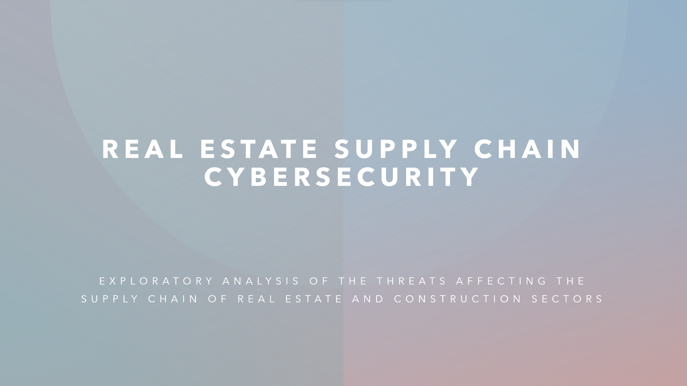

# 

```txt
The following is a summary on research regarding the vulnerabilities posed by digital technology 
threats to the supply chain and operations of real estate and construction and their impact on 
the economy and other sectors
```

---

## CYBERCRIME IN REAL ESTATE

- Phishing/Scams: Perpetrators will spoof accounts and often impersonate someone from within the company in attempts to obtain more access or
  information
- Wire Fraud: Criminals will attempt convincing the business into sending a wire to wrong accounts by posing as escrow agents, attorneys, and even
  buyers/clients (IC3, 2021)
- Ransomware: RE companies are seeing a rise in attacks of information availability due to the increased reliance on business and information
  systems for their operations (IC3, 2021)
- **IoT Vulnerabilities:** From printer to other devices connected to th internet are opening ways fo hackers to intercept networks du to poor
  security standards (i.e. printers without WPA2 protocol)
- Trojans: Oftentimes, RE agents might not be properly trained to distinguish legitimate websites, emails, and have poor internet hygiene leading
  to banking trojans and more
- Data Breaches: As in many other industries, data breaches are a leading cause for slowdowns, reputation damage, and financial loss

## WHAT MAKES REAL ESTATE AN ATTRACTIVE TARGET?

- The type of data involved in the business which can include financing data, lease and rental application information, credit reports and PCI
  related data, bank statements, and all sorts of PII (KPMG, 2018)
- A slew of vulnerabilities ranging from technical (IoT, lack of protocols, outdated systems) to the human element (email communications, lack of
  training, poor internet habits) (IC3, 2021)
- Real estate is a profitable business often involving high value transactions, lucrative deals, wide range of assets, and large amounts of
  financial information (Deloitte, 2015)

## WHERE ARE THE RISKS?

- **Leadership:** Executives and senior management personnel lack ability to
  establish proper cybersecurity roadmaps (KPMG, 2018)
- **Social Engineering:** Call center teams, receptionists, and real estate agents all
  fall victim to social engineering tactics, often by perpetrators faking to be
  someone from senior management, attorneys and escrow agents, and even
  clients (IC3, 2021)
- **Lack of Training:** Absence of cyber awareness policies at all levels, from senior
  management to RE agents to third party contractors (Deloitte, 2015)
- **Internal Threats:** Insider threats coming from current and former employees,
  access issues, no culture of security,
- **Third-Party Vendors (Perimeter Protection):** Insufficient security programs
  and standards by external contractors and third-party suppliers, contractors,
  and subcontractors pose threats to even the most protected companies
  (KPMG, 2018)
- **Underdeveloped cybersecurity plans/response:** Need for development of
  cyber breach response plans and culture/mentality of “not if, but when” (EY, 2018)

## WHO ARE THE BIGGEST THREATS?

- **Common attacks:** These types of attacks are often carried out by amateur
  cybercriminals and include email phishing and cellphone smishing
  campaigns, low-quality social engineering attempts, and easily detectable
  schemes or known threats/vulnerabilities (EY, 2018)
- **Sophisticated attacks:** In contrast to the common types of threats, refined
  attacks carry a heavier toll for RE agencies and companies, posing high risks
  and are often carried out by organized cries networks and nation states
  especially during Covid-19 and the movement towards digital
  transformation
- **Rising threats:** These attack vectors are due to new technologies and the
  increasing reliance on IoT and IIoTfrom coffee machines to smart buildings
  (Gartner, 2021)

## THE AGE OF DIGITAL TRANSFORMATION

- As the pandemic developed more and more vulnerabilities have deepened
  as hybrid workforces, remote work and the sudden need to create a social
  distance work environment have accelerated the deployment of digital
  solutions
- The rise and growth of new cloud technologies, client portals and mobile
  and web-based apps have opened doors for emerging threats to all sectors
  (PWC, 2022)
- Companies have accelerated the digitization of their customer and supply-
  chain interactions and of their internal operations by three to four years
  (McKinsey, 2020)

## AUTOMATION AND THE CYBERPHYSICAL DOMAIN

- **Cyber physical systems (CPS)** , smart buildings, interconnected
  ecosystems, and the spread of internet of things into industrial facilities and
  commercial real estate are giving way for emerging threats and new vectors
  of attack (Gartner, 2021)
- **Automation and robotization** of production lines, building facilities,
  industrial networks, and the convergence of cyber and physical domains are
  broadening the surface for attacks and increasing the risk of vulnerable
  environments unknown for leaders
- **Digital transformation** from a business perspective has acted as a catalyst
  for increased use and reliance on cutting-edge technology that is poorly
  understood by business leaders
- **Operational technology** vulnerabilities are a rising due to the complex
  nature of the mesh of networks created by the increased use of CPS
  (Gartner, 2021)

## INDUSTRIAL INTERNET OF THINGS AND CPS HACKS

- **Emerging smart building technologies** including sensor enabled heating and cooling systems, alarm systems, door access and security systems
- 2016 attack on Finnish **computerized heating distribution centers** **disabled heat to apartment buildings** (BDO, 2017)
- Springhill Medical Center is being sued for what could be **the first death** **directly attributable to ransomware**, when clinical devices
  became unusable (Gartner, 2021)
- Colonial Pipeline **stopped all its fuel processing for days** when it fell victim to a ransomware attack
- An attacker managed to **physically move gauges** in Oldsmar, Florida

## CYBERCRIME AND THE SUPPLY CHAIN CRISIS

- **Covid-19 acted as a catalyst** for many manufacturing and logistic companies to increase reliance on digital and automation technologies and
  business systems
- Cyberattacks on manufacturing companies spiked by over 300% during 2021 according to the Global Threat Intelligence Report (PWC, 2022)
- Cyber supply chain risks is **more than an IT problem** (people, process, knowledge, infrastructure)
- Increased phishing and ransomware attacks affecting manufactures and suppliers

## REAL ESTATE CRITICAL INFRASTRUCTURE

- Difficulties associated with **securing complex manufacturing processes**
  **and operational technology** from any sector that uses industrial control
  systems (BDO, 2017)
- Many of the 16 CI sectors are **within the scope of real estate and**
  **construction industry** , from logistic systems, transport networks,
  government and commercial facilities, and defense industry bases (BDO, 2017)
- Construction companies contracting with the government must also
  consider their **subcontractor’s cybersecurity standards** : Any weak cyber
  link can create a vulnerability
- **California added real estate to its list of critical infrastructure** including
  industrial, commercial, residential and sheltering facilities and services
  (California Essential CI, 2020)

## WHAT ARE THE IMPLICATIONS?

- Loss of data either company financial data, customer, or project information
- Compromised employee information and payroll systems
- System and/or server shutdown
- Stolen intellectual property
- Lawsuits stemming from the failure to protect certain types of data
- Fees to get systems back online
- Ransom paid to hacker groups
- Regulatory fees/penalties
- Reputational damage Involuntary downtime

## THE COSTS OF CYBERCRIME

- Smaller companies run a high risk of going out of business
- Slowdowns in development, causing delays worth thousands and potentially millions of dollars
- All actors involved in the supply chain are affected (in real estate usually there are many parties with an investment)

## REAL ESTATE CYBERSECURITY

- **Ensuring proper internet habits and information security hygiene**
  including email and password verification, validation, management, and
  sharing. (Training against phishing tactics, sender confirmation, user
  credential management)
- **Development and establishment of a culture based around security** and
  protection of data and systems, including two-factor authentication,
  email/password encryption, Wi-Fi security.
- **From a technical perspective** , usage of antivirus and firewall management,
  database backups, network security, active response plans.
- **Close collaboration with legal department** for proper written disclosure
  notices, ensuring up to date knowledge of laws and policies surrounding
  cybersecurity and real estate
- **Policy management** including document retention/destruction, data
  security standards, breach response notice
- Consider having **cyber liability insurance** coverage

## SUPPLY CHAIN CYBERSECURITY

- A major point for security of supply chain and manufacturing systems rely deeply
  on having a **culture of security** and accepting that cybersecurity problems exist
  and create a risk to the bottom line (“it’s just a matter of time” mentality)
- **Proper update and patchwork** of firmware, software, and hardware around all
  automation technology and systems (this includes anything from printers to
  assembly machines to HVAC systems)
- **CPS security** is key to remediate the growing gaps between the physical and
  digital interconnected systems (NIST CSCBP)
- **Third party services** such as software engineering all the way to janitorial
  services, suppliers, hardware providers, and anyone or anything that may impact
  physical security of systems (perimeter protection)
- **Onsite physical security** , many manufactures and companies from all industries
  have solid public interface security, but what about someone with a laptop on
  premise, a contractor with enough access, or an unlocked door into an IT room
  or important office

---

## ENDNOTES

```txt
- EY, Cybersecurity regained: preparing to face cyber attacks 20th Global Information Security Survey 2017–18, 2018
- KPMG, Securing Real Estate Assets in a Digital World: How internal audit can focus your organization’s cybersecurity, 2018
- NAR, CYBERSECURITY CHECKLIST: Best Practices for Real Estate Professionals, 2020
- Deloitte, Evolving cyber risk in commercial real estate. What you don’t know can hurt you, 2015
- Gartner, 3 Initial Steps to Address Unsecure Cyber-Physical Systems, 2021
- BDO, Real Estate and Construction Monitor, 2017
- RCG, Housing is Critical Infrastructure: Social and Economic Benefits of Building More Housing, 2021
- ExecutiveN- 33 - 20** ,Governor Newsom, 2020
- McKinseyCompany** , How COVID-19 has pushed companies over the technology tipping point and transformed business forever, 2020
- FBI, Internet Crime Report, 2021
- NIST, Best Practices in Cyber Supply Chain Risk Management
- Propmodo, A New, Turbulent Era for Real Estate Supply Chains, 2022
- PWC, Manufacturers ramp up cyber defenses as supply-chain bottlenecks and vulnerabilities deepen, 2022
- NIST, C-SCRM Fact Sheet, 2022
```
